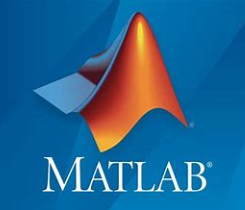

# 第1章 概述

## 1.1 引言

数字信号处理是一种通过数字信号芯片，将声音、图片、视频等模拟信号转化为数字信息的一个过程。在这一过程中，采用数字方式对模拟信号进行采样、滤波、变换等处理，最终转化为数字信号。20世纪50年代，抽样数据系统研究的进展和离散系统理论的发展奠定了数字信号处理的数学基础。离散傅立叶变换（Discrete Fourier Transform，DFT），是傅立叶变换（Fourier Transform，FT）在时域和频域上都呈现离散的形式，将时域信号的采样变换为在离散时间傅立叶变换（Discrete Time Fourier Transform，DTFT）频域的采样。离散傅立叶变换是数字信号处理最重要的基石之一，也是对信号进行分析和处理时最常用的工具之一。1965年库利（James William Cooley, 缩写为J.W.Cooley）和图基（John Wilder Tukey，缩写为J.W.Tukey）首先提出离散傅立叶变换的快速算法，简称快速傅立叶变换（Fast Fourier Transform，FFT）。自有了快速算法以后，离散傅立叶变换的运算次数大为减少，使数字信号处理的实时实现成为可能。同一时期，应用计算机逼近和仿真模拟滤波器的数字滤波理论也得到发展。快速傅立叶变换和数字滤波理论形成了数字信号处理的两大支柱。大规模数字集成电路的出现，为数字信号处理的实现提供了有利的条件。因而，从上世纪60年代以来，逐渐形成了一门新的学科——数字信号处理。

## 1.2 信号和系统

信号可定义为一传载信息的函数，其自变量常取为时间，虽然事实上它可以不代表时间，也不一定只限于有一个自变量。除了时间变量外，信号还可以是以空间坐标为变量的函数。例如图像信号是一个以时间变量和二元空间变量表示的一个亮度函数。信号常分为：

#### 模拟信号

在连续时间范围内所定义的信号，信号的幅值可以取连续范围内任意数值，即时间连续，幅度也连续的信号。如图1.2.1(a)所示

#### 连续时间信号

在规定的连续时间内，信号的幅值可以是连续值也可以是离散值（其幅度随时间作跳跃式的变化）的信号。“连续时间信号”与“模拟信号”经常用来说明同一信号，可以互相通用。模拟信号可视为连续时间信号的一个特例。因为“模拟”与“模仿”容易混淆，所以一般以采用“连续时间信号”为宜，只有在与“数字”相提并论时，才用“模拟”这个名词。本书后面对模拟信号与连续时间信号概称连续时间信号。

#### 离散时间信号

在一组离散的时间下表示信号数值的函数。因为最常遇到的离散时间信号是模拟信号在时间上以均匀（有时也以非均匀）间隔的采样，所以离散时间信号又称为采样信号或序列。

#### 数字信号

在时间上和幅度上都经过量化的信号。“量化”是利用一组数值来表示变量的过程。所谓“量化变量”实际上就是一组不同的数值。因此，数字信号可以用一序列的数来表示，而每一个数又是由有限个数码来表示的。“离散时间”与“数字”也经常用来说明同一信号。离散时间信号的一些理论也适用于数字信号。

几乎在科学技术的每一领域，为了信号的提取，必须进行信号处理。凡是反映信号处理因果关系的设备或运算都称为系统。信号处理系统可与信号按同样思路进行分类。

连续时间系统 输入与输出皆为连续时间信号的系统。 离散时间系统 输入与输出皆为离散时间信号的系统。 模拟系统 输入与输出都是模拟信号的系统。 数字系统 输入与输出都是数字信号的系统。 本书主要研究数字（离散）信号和系统。

## 1.3 Matlab

&#x20;

MATLAB 是美国MathWorks公司出品的商业数学软件，用于算法开发、数据可视化、数据分析以及数值计算的高级技术计算语言和交互式环境，主要包括MATLAB和Simulink两大部分。MATLAB可以进行矩阵运算、绘制函数和数据、实现算法、创建用户界面、连接其他编程语言的程序等，主要应用于工程计算、控制设计、信号处理与通讯、图像处理、信号检测、金融建模设计与分析等领域。它将数值分析、矩阵计算、科学数据可视化以及非线性动态系统的建模和仿真等诸多强大功能集成在一个易于使用的视窗环境中，为科学研究、工程设计以及必须进行有效数值计算的众多科学领域提供了一种全面的解决方案。SIMULINK是MATLAB中的一种可视化仿真工具， 是一种基于MATLAB的框图设计环境，是实现动态系统建模、仿真和分析的一个软件包，被广泛应用于线性系统、非线性系统、数字控制及数字信号处理的建模和仿真中。Simulink提供一个动态系统建模、仿真和综合分析的集成环境。在该环境中，无需大量书写程序，而只需要通过简单直观的鼠标操作，就可构造出复杂的系统。

MATLAB系统主要包括五个部分：桌面工具和开发环境，数字函数库、语言、图形处理、外部接口。其中桌面工具包括MATLAB桌面和命令窗口、编辑器和调试器、代码分析器和浏览帮助、工作空间、文件的浏览器。MATLAB包括拥有数百个内部函数和三十几种工具箱，包含功能性工具箱和学科工具箱。功能工具箱用来扩充MATLAB的符号计算，可视化建模仿真，文字处理及实时控制等功能。学科工具箱是专业性比较强的工具箱，如控制工具箱，信号处理工具箱，通信工具箱等。开放性使MATLAB广受用户欢迎。除内部函数外，所有MATLAB各种工具箱都是可读可修改的文件，用户通过对源程序的修改或加入自己编写程序构造新的专用工具箱。

Signal Processing Toolbox提供了一些函数和App，用来分析、预处理及提取均匀和非均匀采样信号的特征。该工具箱包含可用于滤波器设计和分析、重采样、平滑处理、去趋势和功率谱估计的工具。该工具箱还提供了提取特征（如变化点和包络）、寻找波峰和信号模式、量化信号相似性以及执行 SNR 和失真等测量的功能。还可以对振动信号执行模态和阶次分析。使用信号分析器可以：在时域、频域和时频域同时预处理和分析多个信号，而无需编写代码；探查长信号；以及提取关注的区域。通过滤波器设计工具，可以从多种算法和响应中进行选择来设计和分析数字滤波器。这两个App都生成MATLAB代码。

DSP System Toolbox提供算法、应用程序和示波器，用于在MATLAB和Simulink中设计、仿真和分析信号处理系统。您可以为通信、雷达、音频、医疗设备、物联网和其他应用程序建模实时 DSP 系统。借助 DSP System Toolbox，可以设计和分析 FIR、IIR、多速率、多级和自适应滤波器。可以流式传输来自变量、数据文件和网络设备的信号，以进行系统开发和验证。时间范围、频谱分析仪和逻辑分析仪让您可以动态地可视化和测量流信号。对于桌面原型设计和嵌入式处理器（包括ARM Cortex架构）的部署，该工具箱支持 C/C++代码生成。它还支持从滤波器、FFT、IFFT 和其他算法中进行位精确的定点建模和 HDL 代码生成。算法可用作 MATLAB 函数、系统对象和 Simulink 模块。

## 1.4 Python

 Python由荷兰数学和计算机科学研究学会的Guido van Rossum 于1990 年代初设计，作为一门叫做ABC语言的替代品。 Python提供了高效的高级数据结构，还能简单有效地面向对象编程。Python语法和动态类型，以及解释型语言的本质，使它成为多数平台上写脚本和快速开发应用的编程语言， 随着版本的不断更新和语言新功能的添加，逐渐被用于独立的、大型项目的开发。 Python解释器易于扩展，可以使用C或C++（或者其他可以通过C调用的语言）扩展新的功能和数据类型。 Python 也可用于可定制化软件中的扩展程序语言。Python丰富的标准库，提供了适用于各个主要系统平台的源码或机器码。

由于Python语言的简洁性、易读性以及可扩展性，在国外用Python做科学计算的研究机构日益增多，一些知名大学已经采用Python来教授程序设计课程。例如卡耐基梅隆大学的编程基础、麻省理工学院的计算机科学及编程导论就使用Python语言讲授。Python拥有一个强大的标准库。Python语言的核心只包含数字、字符串、列表、字典、文件等常见类型和函数，而由Python标准库提供了系统管理、网络通信、文本处理、数据库接口、图形系统、XML处理等额外的功能。Python标准库命名接口清晰、文档良好，很容易学习和使用。Python社区提供了大量的第三方模块，使用方式与标准库类似。它们的功能无所不包，覆盖科学计算、Web开发、数据库接口、图形系统多个领域，并且大多成熟而稳定。众多开源的科学计算软件包都提供了Python的调用接口，例如著名的计算机视觉库OpenCV、三维可视化库VTK、医学图像处理库ITK。

而Python专用的科学计算扩展库就更多了，NumPy、SciPy和matplotlib就是三个十分经典的科学计算扩展库，它们分别为Python提供了快速数组处理、数值运算以及绘图功能。NumPy（Numerical Python）是Python语言的一个扩展程序库，支持大量的维度数组与矩阵运算，此外也针对数组运算提供大量的数学函数库。Scipy（Scientific Python）是世界上著名的Python开源科学计算库，建立在Numpy之上，用于数学、科学、工程学等领域。SciPy函数库在NumPy库的基础上增加了众多的数学、科学以及工程计算中常用的库函数。例如线性代数、常微分方程数值求解、信号处理、图像处理、稀疏矩阵等。它用于有效计算Numpy矩阵，使Numpy和Scipy协同工作，高效解决问题。Matplotlib是Python编程语言及扩展包的通用的图形用户界面工具包。因此Python语言及其众多的扩展库所构成的开发环境十分适合工程技术、科研人员处理实验数据、制作图表，甚至开发科学计算应用程序。

目前除了MATLAB的一些专业性很强的工具箱还无法被替代之外，MATLAB的大部分常用功能都可以在Python世界中找到相应的扩展库。和MATLAB相比，用Python做科学计算有如下优点：首先，MATLAB是一款商用软件，并且价格不菲。而Python完全免费，众多开源的科学计算库都提供了Python的调用接口。用户可以在任何计算机上免费安装Python及其绝大多数扩展库。其次，与MATLAB相比，Python是一门更易学、更严谨的程序设计语言。它能让用户编写出更易读、易维护的代码。最后，MATLAB主要专注于工程和科学计算。然而即使在计算领域，也经常会遇到文件管理、界面设计、网络通信等各种需求。而Python有着丰富的扩展库，可以轻易完成各种高级任务，开发者可以用Python实现完整应用程序所需的各种功能。


